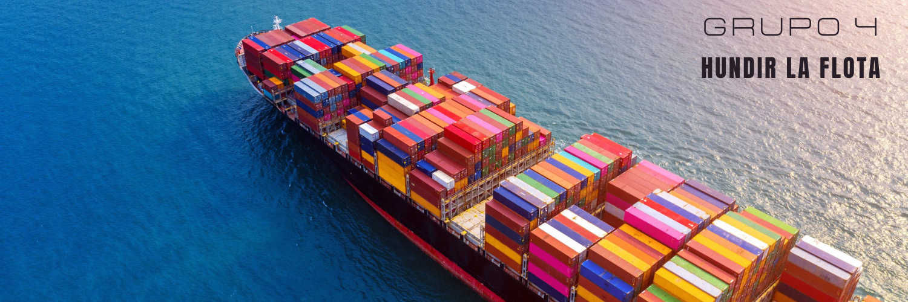

# GRUPO 4. Hundir la Flota.

## 👨‍💻 | ABOUT US
 - Antonio Jiménez Jiménez
 - Gonzalo Márquez De Torres
 - Alba Palomino Jiménez
 - Rafael Emilio Pérez
 - Carlos Rivero Talavera
 - Silvia Roldán Flores
 
 ## 👨‍💻 | SOME TECHNOLOGIES WE USE

 
 

### HOW TO RUN

First of all we have to be connected to UCO network, by VPN or Wifi.

In this project directory, you can run:

### `git clone`

To clone the repository into your personal computer.

### `cd Hundir-la-flota/App/frontend`

To get into the frontend.

### `npm install`

To install the dependences.

### `npm run build`

Builds the app for production to the build folder.

### `cd ..`

Get into the previous folder.

### `python3 manage.py runserver`

To run the backend server with the frontend.